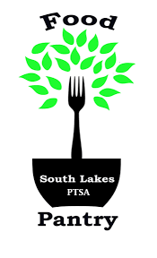

# 🥫 Food Logger – South Lakes Food Pantry Scale System



This project is a touchscreen-friendly Python app for logging food donations by weight, using a DYMO S100 USB scale. It is used by South Lakes Food Pantry to track donation types and sources efficiently.

---

## 📦 Features

- Real-time USB scale reading (via `pywinusb`)
- Touchscreen-friendly GUI using `tkinter`
- Separate CSV logs per food source
- Category totals displayed and logged
- Undo last entry
- Custom food source management
- Logo/image branding
- Cross-platform design (Windows-focused)

---

## 📁 Project Layout

```
food-logger/
├── old_SLFPScale/         # Legacy version (archived)
│   └── southlakes_food_pantry.py
├── scale_logger/          # New modular refactor
│   ├── __init__.py
│   ├── main.py
│   └── logger_gui.py
├── assets/                # Logos, icons
│   ├── scale_icon.png
│   ├── scale_icon.ico
│   └── slfp_logo.png
├── environment.yml        # Conda env file
├── .gitignore
└── README.md
```

---

## 🚀 Getting Started

### ✅ 1. Clone the repo

```bash
git clone git@github.com:wyojustin/food-logger.git
cd food-logger
```

### ✅ 2. Create Conda environment

```bash
conda env create -f environment.yml
conda activate foodlog
```

If you don’t have `environment.yml`, you can create the environment manually:

```bash
conda create -n foodlog python=3.13 spyder pillow pandas pywinusb matplotlib
```

### ✅ 3. Launch the App

```bash
cd scale_logger
python main.py
```

Or use **Spyder IDE** for GUI debugging.

---

## 🔌 Hardware Required

- **DYMO S100 USB Scale**
- Windows 10+ with USB support
- Optional: Touchscreen display

---

## 🧠 Goals for Refactor

- Modular separation of logic and GUI
- Support headless logging mode (future)
- Streamlined syncing between multiple locations (school ↔ home)
- Optional CSV cloud sync

---

## 🛠️ License

MIT License — South Lakes Food Pantry is welcome to use and extend.
